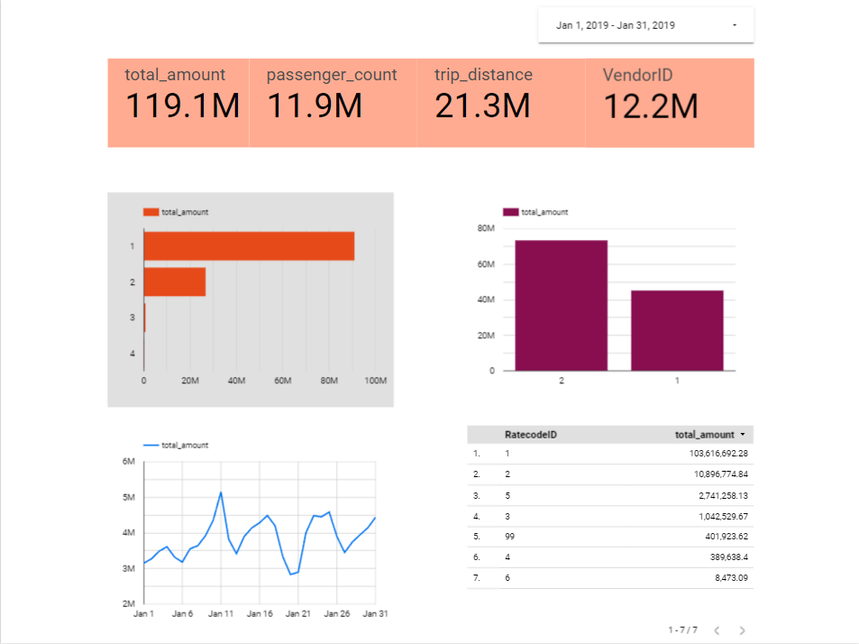

# 05-data-visualization-and-spark-install

## Task Description

### Dashboard Screenshot

### Dashboard URL

https://datastudio.google.com/reporting/c31bd27e-8adf-4341-9f25-480c73dcf933

### Explanation

On the first row of the dashboard, there's 4 type of scorecard each showing different kind of metrics that helps people instantly know the sum of things.  Such as total amount of income, passenger count, trip distance and total vendor.

On the second row exist two type of charts, first is horizontal column showing 4 different payment type grouped by total amount each payment type generated.  While the second is vertical column to compare 2 of the existing vendor who generated the most total amount between the two.

On the third row exist time series graph and a table.  The graph show the total amount generated each day from january 1-31, while the table show each generated total amount by rate code (1-6) the 99 id is a noise.
