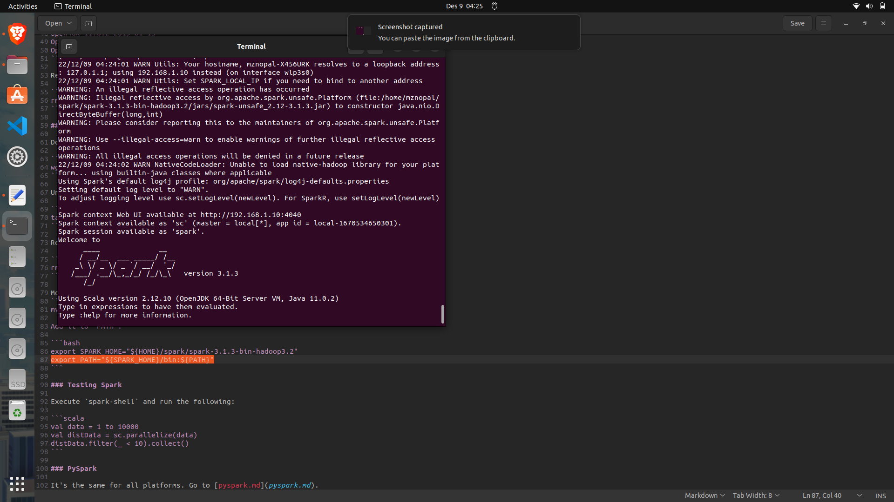

# Spark and PySpark Installation

## Linux

Here we'll show you how to install Spark 3.1.3 for Linux.
We tested it on Ubuntu 22.04, but it should work
for other Linux distros as well

### Installing Java

Download OpenJDK 11 or Oracle JDK 11 (It's important that the version is 11 - spark requires 8 or 11)

We'll use [OpenJDK](https://jdk.java.net/archive/)

Download it (e.g. to `~/spark`):

```
wget https://download.java.net/java/GA/jdk11/9/GPL/openjdk-11.0.2_linux-x64_bin.tar.gz
```

Unpack it:

```bash
tar xzfv openjdk-11.0.2_linux-x64_bin.tar.gz
```

Move folder jdk-11.02 inside spark folder:

```bash
mv jdk-11.02 ~/spark/
```

define `JAVA_HOME` and add it to `PATH`:

```bash
export JAVA_HOME="${HOME}/spark/jdk-11.0.2"
export PATH="${JAVA_HOME}/bin:${PATH}"
```

check that it works:

```bash
java --version
```

Output:

```
openjdk 11.0.2 2019-01-15
OpenJDK Runtime Environment 18.9 (build 11.0.2+9)
OpenJDK 64-Bit Server VM 18.9 (build 11.0.2+9, mixed mode)
```

Remove the archive:

```bash
rm openjdk-11.0.2_linux-x64_bin.tar.gz
```

### Installing Spark

Download Spark. Use 3.1.3 version:

```bash
wget https://dlcdn.apache.org/spark/spark-3.1.3/spark-3.1.3-bin-hadoop3.2.tgz
```

Unpack:

```bash
tar xzfv spark-3.1.3-bin-hadoop3.2.tgz
```

Remove the archive:

```bash
rm spark-3.1.3-bin-hadoop3.2.tgz
```

Move spark3.1.3 to spark folder:

````bash
mv spark-3.1.3-bin-hadoop3.2 ~/spark/

Add it to `PATH`:

```bash
export SPARK_HOME="${HOME}/spark/spark-3.1.3-bin-hadoop3.2"
export PATH="${SPARK_HOME}/bin:${PATH}"
````

### Testing Spark

Execute `spark-shell`, if you succeed, you'll see something like this:



Also try running the following code, to make sure that everything works:

```scala
val data = 1 to 10000
val distData = sc.parallelize(data)
distData.filter(_ < 10).collect()
```

### Additional: Permanently add `JAVA_HOME` and `SPARK_HOME` to `PATH`

To make sure that `JAVA_HOME` and `SPARK_HOME` are set every time you open a new terminal, refer to this guide:

https://phoenixnap.com/kb/linux-add-to-path

## PySpark

This document assumes you already have python.

To run PySpark, we first need to add it to `PYTHONPATH`:

```bash
export PYTHONPATH="${SPARK_HOME}/python/:$PYTHONPATH"
export PYTHONPATH="${SPARK_HOME}/python/lib/py4j-0.10.9.9-src.zip:$PYTHONPATH"
```

Make sure that the version under `${SPARK_HOME}/python/lib/` matches the filename of py4j or you will
encounter `ModuleNotFoundError: No module named 'py4j'` while executing `import pyspark`.

For example, if the file under `${SPARK_HOME}/python/lib/` is `py4j-0.10.9.3-src.zip`, then the
`export PYTHONPATH` statement above should be changed to

```bash
export PYTHONPATH="${SPARK_HOME}/python/lib/py4j-0.10.9.3-src.zip:$PYTHONPATH"
```

### Check that PySpark works

If you succeed, you can run `pyspark` and you'll see something like this:


Now you can run Jupyter or IPython to test if things work. Go to some other directory, e.g. `~/tmp`.

Download a CSV file that we'll use for testing:

```bash
wget https://s3.amazonaws.com/nyc-tlc/misc/taxi+_zone_lookup.csv
```

Now let's run `ipython` (or `jupyter notebook`) and execute:

```python
import pyspark
from pyspark.sql import SparkSession

spark = SparkSession.builder \
    .master("local[*]") \
    .appName('test') \
    .getOrCreate()

df = spark.read \
    .option("header", "true") \
    .csv('taxi+_zone_lookup.csv')

df.show()
```

Test that writing works as well:

```python
df.write.parquet('zones')
```

If you succeed, you should see something like this:


You'll also find the `zones` folder in the current directory.
